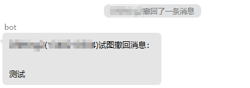

# mirai-groupUnrecall

基于 Mirai Console 的 QQ 群防撤回插件

### 功能

* 当撤回群消息的人是发信人本人时，bot 会复述被撤回的纯文本信息



### 开始使用

从 release 中下载 jar 文件，将 jar 文件放进 Mirai Console 的 plugins 文件夹中

### 插件设置

设置文件`Setting.yml`会在插件首次加载后，被创建于`config/groupUnrecall`

`Setting.yml`内容示例如下：

```yaml
# 单个群的历史消息暂存数量
length: 20
# 开启防撤回功能的群，多个群号用英文逗号隔开。
# 群号为空则对所有群开启功能
groups: [ 12345679,   #群1
          987654321,  #群2
          123456789   #群3
]
```

修改完成后重启 Mirai Console 应用新设置

### 注意事项

* 插件会把群消息的纯文本信息暂存在内存，这个存储数量是有限的
    * 若被撤回消息时间太久远，bot 会因找不到历史消息而不做反应
    * 请在`Setting.yml`中设置`length`以更改存储数量
* 暂存消息的数量、开启防撤回功能的群号，可在设置文件`Setting.yml`中设置
    * 修改`Setting.yml`需要重启 Mirai Console 才能应用新设置